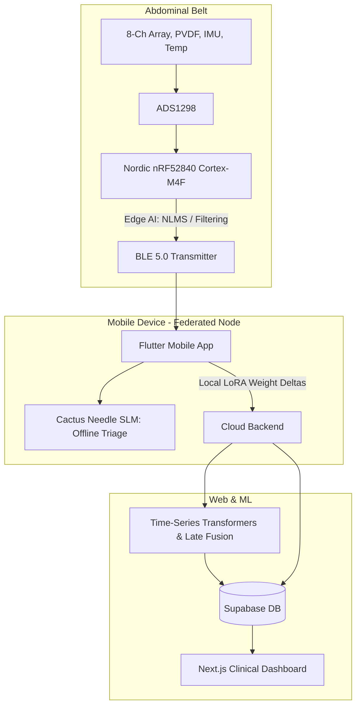

# System Architecture (Architecture.md)
## Project: AURA-MOM PRO

### 1. Topology & Component Mesh

### 2. DSP / AI Pipeline
1. Hardware anti-aliasing and synchronized acquisition.
2. 50-Hz mains interference suppression (without distorting fetal QRS morphology).
3. 0.5Hz High-Pass Filter (Butterworth) for maternal baseline wander removal.
4. Separate digital branches for ECG/fECG, EHG and acoustic signals.
5. IMU-driven motion/artifact quality index.
6. **Adaptive Filtering (NLMS):** Extract fECG efficiently in real-time.
7. Fetal QRS detection → FHR series → Signal quality score.
8. Feature extraction (EHG: Sample Entropy, Teager-Kaiser; PVDF: Heart sounds; PPG: Pulse rate).
9. **Multimodal Late Fusion:** 1D-CNN (Electrical) + 2D-CNN (Acoustic Spectrograms) fuse into Time-Series Transformer for predictive modeling.
10. Output triage state (`NORMAL` / `REVIEW` / `URGENT ASSESSMENT`).
