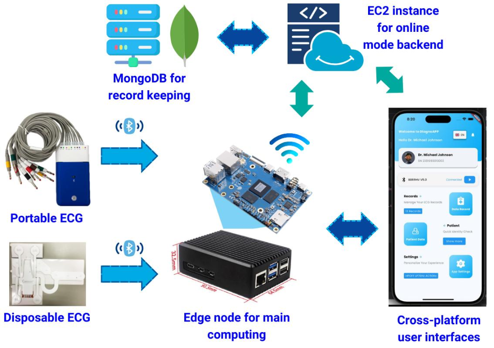
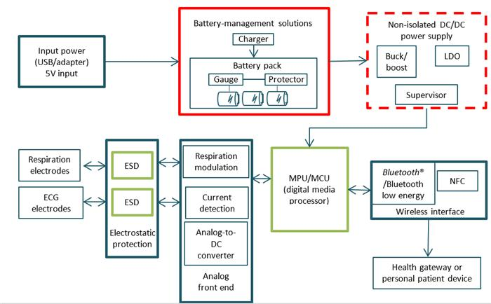
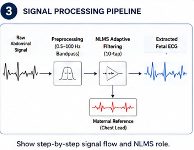
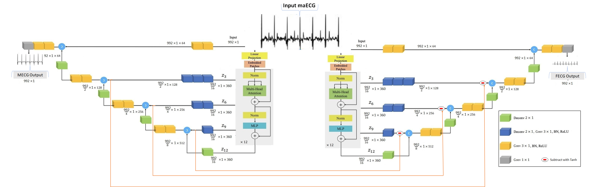

<div align="center">
  
  
  # AURA-MOM PRO: Non-Invasive Fetal ECG Extraction at the Edge
  
  **Submission Entity:** Team Netizen | **Event:** Vishwakarma Stage 1
  
  [](#)
  [](#)
  [](#)
  [](#)
  [](#)

</div>

---

## 📖 Executive Overview

AURA-MOM PRO is an advanced biomedical engineering initiative focused on extracting **non-invasive fetal electrocardiography (NI-FECG)** from mixed maternal abdominal signals. Designed for edge deployment, the system captures complex electrical biosignals and cleanly isolates the fetal heartbeat, bypassing the need for invasive scalp electrodes.

<div align="center">
  
  <br><em>High-Level Edge-to-Cloud System Architecture</em>
</div>

---

## 🎛️ Hardware & Signal Acquisition

Our physical edge device is meticulously engineered to capture microvolt-level fetal signals while filtering out ambient noise and maternal interference.

<div align="center">
  
  
</div>

* **Analog Front-End (AFE):** High-CMRR instrumentation amplifiers extract the raw trans-abdominal signal.
* **MCU Subsystem:** The Nordic nRF52840 handles real-time data ingestion and runs our ultra-low power DSP pipeline.
* **Analog Filter Chain:** Active bandpass and notch filters pre-condition the signal before it reaches the ADC.

---

## ⚡ The Dual-Track Algorithm Evaluation

We rigorously evaluate our production baseline against our research hypothesis to ensure we deploy the most optimal solution to the edge:

<div align="center">
  
</div>

### 1. Production Baseline: Classical DSP (Submitted)
The core embedded solution is a highly optimized, deterministic **32-tap Normalized Least Mean Squares (NLMS)** adaptive filter. It is designed to run directly on the nRF52840 SoC.

* **Memory Footprint:** `< 1 KB (SRAM)`
* **Compute Cost:** `32 MACs / sample`
* **Latency:** `7.5 µs / sample`
* **Real-world Performance:** `RMSE 0.1005 mV` (ADFECGDB subject r10)

### 2. Research Track: Deep Learning (Ongoing)
To discover the absolute ceiling of signal clarity, we are actively evaluating the **W-NETR** (Wavelet-inspired U-Net Transformer) architecture using the Syzygy Methodology.

<div align="center">
  
  <br><em>W-NETR Deep Learning Architecture for Feature Extraction and Signal Reconstruction</em>
</div>

* **Memory:** `~15 MB (DRAM)`
* **Parameters:** `10.2M`
* **Framework:** `PyTorch`

---

## 📈 Real-World Extraction Results

Below is a visualization of the signal extraction quality on clinical human data (ADFECGDB). Notice how the system successfully isolates the tiny fetal QRS complexes from the overwhelming maternal baseline.

<div align="center">
  
</div>

---

## 💻 Clinical Dashboard

Extracted physiological data is transmitted securely to our interactive web dashboard for real-time obstetric monitoring.

<div align="center">
  
</div>

---

## 🔍 The 60-Second Judge Path

Evaluating this repository for Vishwakarma Stage-1? Please prioritize the following documents:

1. 📄 **Frozen Stage-1 Submissions**:
   * [`AURA_MOM_PRO_Vishwakarma_Stage1_Proposal.pdf`](./AURA_MOM_PRO_Vishwakarma_Stage1_Proposal.pdf)
   * [`MOM_Vishwakarma_Stage1_Proposal.pdf`](./MOM_Vishwakarma_Stage1_Proposal.pdf)
2. 🕵️ **Claim Verification**: All numerical and hardware claims are audited in [`docs/PROPOSAL_CLAIM_AUDIT.md`](./docs/PROPOSAL_CLAIM_AUDIT.md).
3. 🔬 **Ongoing Research**: Review our strict, post-submission evaluation of DL vs DSP in [`docs/POST_SUBMISSION_RESEARCH_UPDATE.md`](./docs/POST_SUBMISSION_RESEARCH_UPDATE.md).
4. 🛡️ **Data Integrity**: We enforce a zero-fabrication clinical data handling policy, detailed in [`docs/DATA_LEAKAGE_AUDIT.md`](./docs/DATA_LEAKAGE_AUDIT.md).

---

## 📂 Repository Architecture

```text
MOM/
├── configs/            # Syzygy-compliant YAML hyperparameter definitions
├── data/
│   ├── manifests/      # Dataset provenance (ADFECGDB, FECGSYNDB, etc.)
│   └── splits/         # Strict Subject-level train/val/test CSV definitions
├── docs/               # Engineering audits, methodology mappings, and verdicts
│   └── assets/         # Diagrams and visual assets (Hardware & Software)
├── experiments/        # Checkpoint registry and execution tracking
├── ml/
│   └── pretrained/     # Raw unmodified W-NETR PyTorch architecture 
└── scripts/            # Orchestrator scripts (e.g., train_wnetr_syzygy.py)
```

## 🚀 Running the Evaluation

To initiate the full convergence Syzygy-orchestrated W-NETR PyTorch run (~45 hours on CPU):

```bash
python scripts/train_wnetr_syzygy.py
```

> **Note:** The hardware deployment firmware (C/C++) for the nRF52840 SoC executing the canonical NLMS filter resides in the designated hardware firmware repository.
