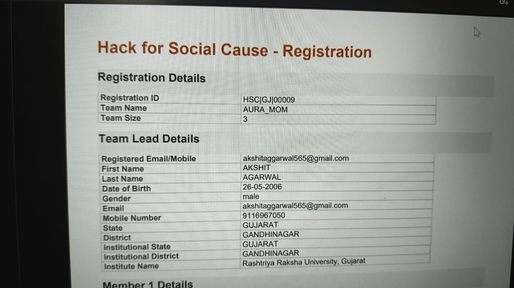
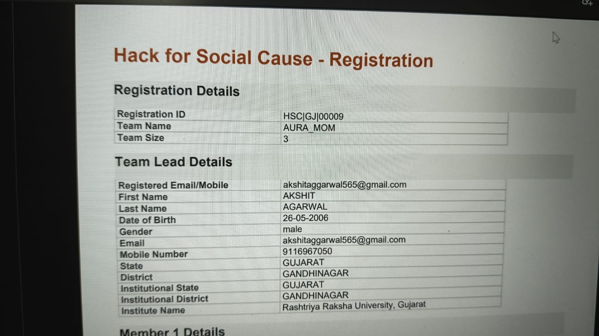

# AURA-MOM PRO 🤰🫀

**Continuous, Non-Invasive Fetal & Maternal Monitoring Platform for Low-Resource Settings**

AURA-MOM PRO is an open-source hardware and software ecosystem designed to provide continuous fetal electrophysiological monitoring (fECG) without the need for expensive ultrasound transducers or specialized clinical operators. 

By leveraging a low-cost COTS (Commercial Off-The-Shelf) hardware stack and deterministic on-chip DSP (Digital Signal Processing), we extract fetal cardiac signals from maternal abdominal recordings, offering a sub-₹5,000 alternative to traditional Cardiotocography (CTG) machines for rural primary healthcare centers.

---

## 📸 System Overview

### 1. The Wearable Architecture
We replaced traditional complex setups with a 2-piece **Belt + Dockable Pod** architecture, enabling easy application by frontline health workers (like ASHA/ANM in India).

### 2. Hardware Subsystem (COTS Stack)
No custom PCB fabrication required. The system is built on modular, accessible components:
- **AFE:** ProtoCentral ADS1292R (24-bit ADC, 120 dB CMRR)
- **MCU & Radio:** Seeed Studio XIAO BLE (nRF52840, Cortex-M4F)
- **Power:** 3.7V Li-Po (USB-C rechargeable)

### 3. End-to-End Topology
Data streams via BLE 5.0 from the patient to any Android tablet or HTML5 browser dashboard. All DSP executes locally on the wearable MCU (Edge Computing), ensuring it works entirely offline.

### 4. Clinical Dashboard App
The application displays raw abdominal input, the extracted fetal waveform, fetal heart rate (FHR), maternal heart rate (MHR), and Signal Quality Index (SQI).

---

## 🧮 DSP Algorithm: Fetal ECG Extraction

Because fetal and maternal ECG signals overlap in frequency (0.5–100 Hz), standard bandpass filtering fails. AURA-MOM PRO uses a **Normalized Least Mean Squares (NLMS) adaptive filter** to cancel the maternal interference.

### Mathematical Approach
1. **Primary Input:** Abdominal mixture (Maternal + Fetal + Noise)
2. **Reference Input:** Thoracic maternal ECG
3. The NLMS filter adapts beat-to-beat to model the maternal transfer function.
4. The filter's **error residual** yields the extracted Fetal ECG candidate.

### Performance Validation (MATLAB/Simulink equivalent)
Below is the extraction performance of our 10-tap NLMS filter.
- **RMSE:** 0.1005 mV (Validated against direct fetal scalp reference)
- **Latency:** ~7.5 µs per sample (Cortex-M4F simulation)
- **Memory:** < 1 KB state footprint

*(Note: The MATLAB script for reproducing these results is available in `scripts/nlms_fecg_extraction.m`)*

---

## 🛠 Repository Structure

- `assets/`: Images and design renders.
- `scripts/`: MATLAB/Python DSP algorithms for extraction validation.
- `results/`: Performance plots and metrics.
- `src/`: (To be added) C++ Firmware for nRF52840 and HTML5 Dashboard code.

## 📄 License
This project is released under the **MIT License**. See the [LICENSE](LICENSE) file for details.

## 🤝 Contributing
AURA-MOM PRO is a generalized open-source project. We welcome contributions in adaptive filtering, BLE optimization, and UI/UX design for the clinical dashboard.
