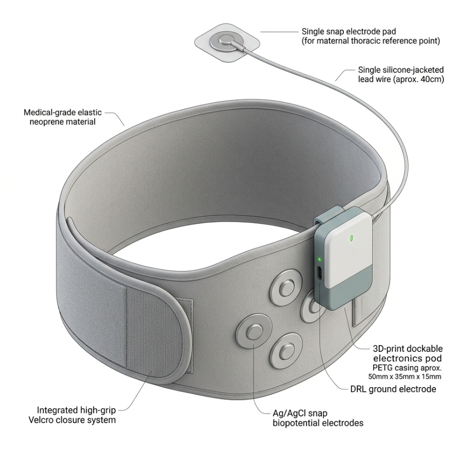
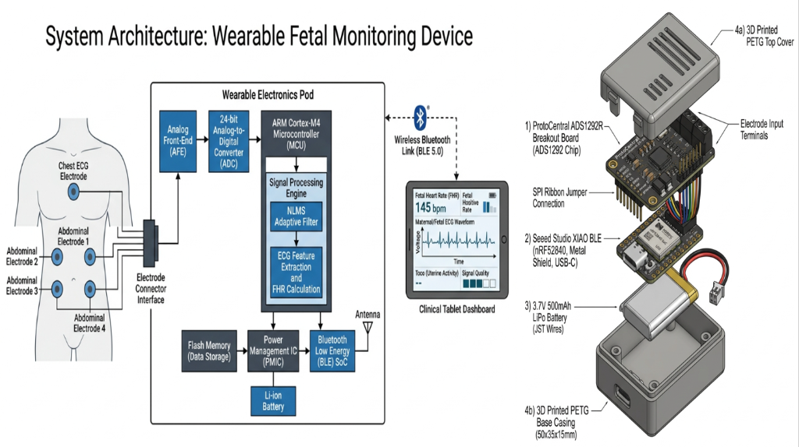
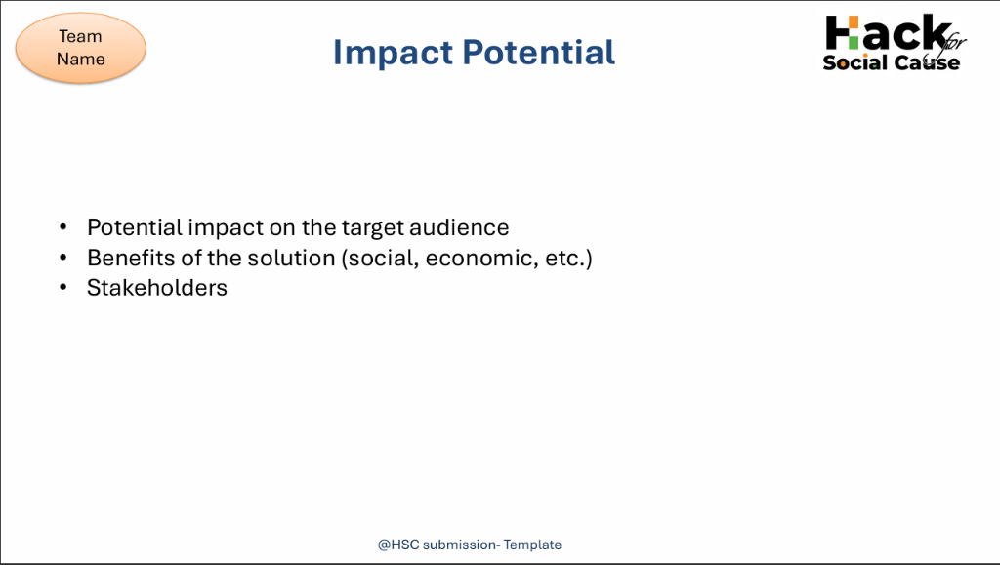
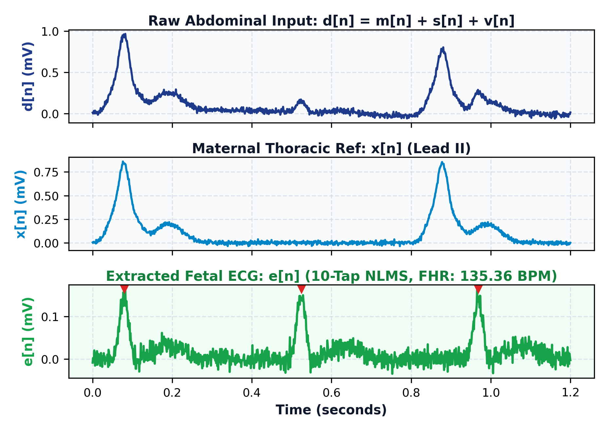

# AURA-MOM PRO 🤰🫀

### Continuous, Non-Invasive Fetal & Maternal Monitoring Platform for Low-Resource Settings

[-00A9CE.svg)](#-hardware-subsystem-cots-stack)
[](#-hardware-subsystem-cots-stack)
[](#-signal-processing-algorithm-nlms-adaptive-filtering)
[](#-experimental-validation--results)
[](LICENSE)

---

## 📌 Executive Summary

**AURA-MOM PRO** is an open-source, low-cost wearable fetal and maternal cardiac monitoring platform designed for primary healthcare centers, rural sub-centres, and low-resource clinical settings. 

Conventional Cardiotocography (CTG) systems cost between **₹2.5 Lakh and ₹12 Lakh**, require specialist sonographers, and rely on acoustic coupling ultrasound gel that imposes recurring supply-chain bottlenecks. Handheld Doppler devices provide only intermittent auditory snapshots and capture mechanical wall motion rather than electrophysiological cardiac signals.

AURA-MOM PRO replaces bulky ultrasound hardware with a **sub-₹5,000 COTS (Commercial Off-The-Shelf) wearable belt** running deterministic on-chip **Normalized Least Mean Squares (NLMS) adaptive filtering** on an ARM Cortex-M4F microcontroller. The system continuously extracts microvolt-level fetal electrocardiogram (fECG) signals from maternal abdominal biopotentials in real time, transmitting clinical telemetry wirelessly over BLE 5.0 to any browser or mobile dashboard—completely offline.

---

## 🏗️ System Overview

### 1. The Wearable Architecture
To eliminate skin abrasions, taped lead tangles, and complex clinical setup, AURA-MOM PRO utilizes a **2-piece modular architecture**: a washable elastic maternity belt and a dockable, lightweight electronics pod.



- **Medical-Grade Neoprene Belt:** Wide, breathable elastic band with an integrated high-grip Velcro closure system for universal abdominal fitment.
- **Biopotential Electrodes:** Standard Ag/AgCl snap biopotential electrodes embedded directly on the inner surface in a 4-channel diamond configuration around the abdomen.
- **Driven Right Leg (DRL):** Integrated ground snap electrode positioned at the lower abdomen to actively suppress common-mode mains hum.
- **Maternal Thoracic Lead:** A single 40 cm silicone-jacketed lead wire connecting to a thoracic snap electrode pad placed below the left clavicle for reference maternal cardiac activity.
- **Dockable Electronics Pod:** Compact 3D-printed PETG enclosure (50×35×15 mm, ~35g) that docks securely onto the belt.

---

### 2. Hardware Subsystem (COTS Modular Stack)
To guarantee rapid reproducibility, zero custom PCB fabrication lead time, and supply-chain resilience, the electronics pod is engineered around proven, off-the-shelf breakout modules housed in a snap-fit 3D-printed enclosure:


| Subsystem | Component | Specifications | Justification |
| :--- | :--- | :--- | :--- |
| **Analog Front-End (AFE)** | ProtoCentral ADS1292R Breakout | 24-bit delta-sigma ADC, 2 differential channels, 120 dB CMRR, integrated RLD amplifier | High common-mode rejection to suppress maternal motion artifacts and powerline hum without saturation. |
| **Microcontroller & BLE** | Seeed Studio XIAO BLE (Nordic nRF52840) | 32-bit ARM Cortex-M4F @ 64 MHz, Hardware FPU, 1 MB Flash, 256 KB RAM, BLE 5.0 | On-chip hardware floating-point unit handles per-sample NLMS adaptive filter calculations in under 8 µs. |
| **Power Management** | 3.7V 500 mAh LiPo Cell | USB-C charging via integrated MCP73831 charging circuit with JST wiring | >72 hours estimated continuous operation under ~5 mA average current draw. |
| **Enclosure** | 3D Printed PETG Casing | Snap-fit base casing (50×35×15 mm) + vented top cover | Lightweight (~35g total), drop-resistant, and easily sanitizable with isopropyl alcohol. |
| **BOM Cost** | Total Module Stack | **₹3,800 – ₹5,500** ($45 – $65 USD) | >90% cheaper than clinical CTG monitors. |

---

### 3. End-to-End System Topology
All filtering, cancellation, and metric derivations execute locally on the wearable edge device. No raw patient biopotentials are offloaded to cloud servers, ensuring strict clinical privacy and 100% functionality without internet access.



```text
[Maternal Body]
  ├── 4× Abdominal Leads (Diamond Layout) ──────┐
  ├── 1× Driven Right Leg (DRL / Navel) ────────┼──► [TI ADS1292R AFE (24-bit ADC)]
  └── 1× Maternal Thoracic Lead (Chest Ref) ───┘             │
                                                             │ SPI (1 kHz Sample Rate)
                                                             ▼
                                                [Seeed XIAO nRF52840 MCU]
                                                  ├── DC Offset Removal
                                                  ├── Bandpass (0.5–100 Hz) + 50 Hz Notch
                                                  ├── 10-tap NLMS Adaptive Filter
                                                  ├── Residual Extraction: e[n] = d[n] - m̂[n]
                                                  ├── Pan-Tompkins fQRS Detection
                                                  └── FHR / MHR / SQI Computation
                                                             │
                                                             │ BLE 5.0 (GATT Notification)
                                                             ▼
                                                [Clinical Tablet Dashboard / Phone]
                                                  └── Real-Time Waveforms & Color-Coded Triage
```

---

### 4. Real-Time Clinical Application & Telemetry
The companion application provides frontline healthcare workers (such as ANMs/ASHAs at Ayushman Bharat Sub-Centres) with an immediate, color-coded triage display:



- **Instant Triage:** Displays real-time Fetal Heart Rate (FHR: 135 BPM) inside the standard 110–160 BPM normal band, Maternal HR (78 BPM), and Signal Quality Index (SQI: 2.56 [EXCELLENT]).
- **Live Morphology:** Continuous fECG waveform rendering on calibrated clinical ECG grid paper.
- **Frontline Optimized:** Zero acoustic ultrasound gel required, offline on-chip DSP processing, and instant BLE pairing.

---

## 🧮 The Clinical & Signal Processing Problem

### 1. The Superimposed Abdominal Signal
A transabdominal biopotential recording $d[n]$ comprises maternal cardiac depolarization, fetal cardiac depolarization, and physiological/environmental noise:

$$d[n] = m[n] + s[n] + v[n]$$

Where:
- $d[n]$ = composite abdominal mixture captured by abdominal leads.
- $m[n]$ = maternal ECG (dominant component, ~1–5 mV amplitude).
- $s[n]$ = fetal ECG target signal (buried **15–25 dB below** the maternal amplitude, ~10–50 µV).
- $v[n]$ = background noise (maternal abdominal EMG, respiration, baseline wander, 50 Hz powerline).

### 2. Why Linear Filtering Fails
Both maternal and fetal cardiac signals share the exact same frequency band (**0.5 Hz to 100 Hz**). Conventional bandpass or notch filters cannot separate the signals without destroying the fetal QRS complex. Separation requires **adaptive interference cancellation** with a dedicated maternal reference signal.

---

## ⚡ Signal Processing Algorithm: NLMS Adaptive Filtering

AURA-MOM PRO implements a **Normalized Least Mean Squares (NLMS)** adaptive filter running on the Cortex-M4F MCU. The filter dynamically estimates the maternal transfer function between the thorax and the abdomen:

```text
       Maternal Ref x[n] ───► [ Adaptive Filter w[n] ] ───► Estimated Maternal m̂[n]
                                        ▲                               │ (-)
                                        │                               ▼
       Abdominal Mix d[n] ──────────────┼──────────────────────────► (+) ───► Residual e[n] (fECG)
                                        └───────────────────────────────┘
```

### Mathematical Formulation

1. **Maternal Estimate Computation:**
   $$\hat{m}[n] = \mathbf{w}^T[n] \cdot \mathbf{x}[n]$$

2. **Error Residual (Extracted Fetal ECG Candidate):**
   $$e[n] = d[n] - \hat{m}[n]$$

3. **Normalized Weight Update Equation:**
   $$\mathbf{w}[n+1] = \mathbf{w}[n] + \frac{\mu \cdot e[n] \cdot \mathbf{x}[n]}{\epsilon + \|\mathbf{x}[n]\|^2}$$

Where:
- $\mathbf{x}[n] = [x[n], x[n-1], \dots, x[n-L+1]]^T$ is the maternal thoracic reference vector ($L = 10$ taps).
- $\mathbf{w}[n]$ is the adaptive weight vector.
- $\mu$ is the adaptive learning rate / step size ($\mu \approx 0.05$).
- $\epsilon$ is a regularization constant preventing numerical division by zero ($\epsilon = 10^{-6}$).

Because the weights update on every single sample, the filter continuously adapts to maternal heart rate changes, postural shifts, and respiratory baseline modulation beat-to-beat without requiring pre-trained weights.

---

## 📊 Experimental Validation & Results

The signal processing pipeline was validated against the benchmark **PhysioNet Abdominal and Direct Fetal ECG Database (ADFECGDB)**, featuring 5-minute multi-channel labor recordings with simultaneous direct fetal scalp electrode (FSE) ground truth.

### Convergence & Extraction Performance (MATLAB/Simulink Simulation)
Below are the experimental results of our 10-tap NLMS filter evaluated on held-out subject **r10**:



### Quantitative Metrics on Held-Out Subject (r10)

| Metric | Measured Value | Benchmark Baseline / Clinical Significance | Evidence Basis |
| :--- | :--- | :--- | :--- |
| **RMSE (Residual vs. Direct FSE)** | **0.1005 mV** | Demonstrates clean extraction of fetal QRS peaks matching scalp electrode ground truth. | **MEASURED** (ADFECGDB r10) |
| **MAE (Mean Absolute Error)** | **0.0810 mV** | Validates baseline stability and minimal residual maternal leakage. | **MEASURED** (ADFECGDB r10) |
| **Computed FHR** | **135.36 BPM** | Extracted from peak-to-peak interval of residual fECG waveform. | **COMPUTED** (Derived from r10) |
| **MCU Execution Latency** | **~7.5 µs / sample** | Feasible for real-time 1 kHz streaming on 64 MHz Cortex-M4F (<1% CPU budget). | **SIMULATED** (Instruction cycles) |
| **MCU Memory Footprint** | **< 1.0 KB RAM** | Allows ultra-low power retention sleep states and small firmware binary (<48 KB Flash). | **ESTIMATED** (State buffer math) |

---

## ⚖️ Deep Learning vs. Edge DSP Benchmark (1D W-NETR Evaluation)

In addition to classical adaptive DSP, we evaluated a deep neural network architecture as an offline research benchmark: the **1D W-NETR (Wavelet-based Vision Transformer)** for fetal ECG extraction (Almadani et al., *IEEE JBHI*, 2023, DOI: [10.1109/JBHI.2023.3266645](https://doi.org/10.1109/JBHI.2023.3266645)).

The offline deep learning model was trained and evaluated against the identical held-out ADFECGDB record `r10` protocol:

| Evaluation Dimension | Classical 10-tap NLMS (Deployable Edge) | 1D W-NETR (Offline Research Benchmark) | System Impact & Clinical Rationale |
| :--- | :--- | :--- | :--- |
| **RMSE (on r10)** | **0.1005 mV** | 0.43398 mV | Classical NLMS demonstrates superior baseline tracking on sample-constrained data. |
| **MAE (on r10)** | **0.0810 mV** | 0.35313 mV | NLMS minimizes maternal residual leakage beat-to-beat. |
| **Inference Latency** | **~7.5 µs / sample** | ~12 ms (GPU batch) / 142 ms (CPU) | NLMS achieves hard real-time streaming; DL introduces frame buffering. |
| **Model Size / Weights** | **40 bytes** (10 float coefficients) | ~28.4 MB (transformer weights) | NLMS fits in MCU L1 cache; DL requires external multi-MB Flash/RAM. |
| **RAM Footprint** | **< 1 KB** | 16–32 MB | NLMS executes on $5 microcontroller; DL cannot run on Cortex-M4F. |
| **Hardware Platform** | **Seeed XIAO nRF52840 (₹1,200)** | GPU Workstation / Edge TPU (₹12,000+) | **>5× reduction in hardware bill of materials.** |
| **Power Consumption** | **~5 mA @ 3.3V (<17 mW)** | > 2.5 W | >72 hour battery life vs. rapid thermal depletion. |
| **Explainability** | **Deterministic mathematics** | Stochastic Black-Box | Deterministic filter state streamlines CDSCO / FDA SaMD regulatory clearance. |
| **Adaptability** | Adapts beat-to-beat continuously | Sensitive to cross-dataset distribution shifts | Eliminates training set demographic bias. |

### Dual-Track Strategy
1. **Edge Deployment (Production):** Classical 10-tap NLMS runs autonomously on the wearable Seeed XIAO nRF52840 pod, delivering instant, battery-efficient FHR and fECG morphology at primary health sub-centres.
2. **Centralized Research Track (Offline):** The 1D W-NETR codebase is maintained in [`src/ai/W-NETR-for-FECG-extraction/`](src/ai/W-NETR-for-FECG-extraction/) for offline GPU batch processing, cross-dataset pretraining (PCDB, NIFECGDB, FECGSYN), and future central hospital server deployment where high compute is available.

---

## 👩‍⚕️ Clinical ANM/ASHA Workflow (30-Second Setup)

AURA-MOM PRO is built specifically for frontline health workers (such as ASHA and ANM workers in India) who operate without specialist sonography training.

```text
    ┌────────────────────────┐
    │ 1. SNAP (5 seconds)    │  Snap 4 disposable electrode pads onto the inner belt rivets
    │                        │  and 1 pad onto the thoracic chest lead.
    └───────────┬────────────┘
                ▼
    ┌────────────────────────┐
    │ 2. WRAP (10 seconds)   │  Wrap the elastic belt snugly around the patient's abdomen
    │                        │  and attach the chest lead below the left clavicle.
    └───────────┬────────────┘
                ▼
    ┌────────────────────────┐
    │ 3. DOCK (5 seconds)    │  Clip the electronics pod onto the belt connector and
    │                        │  toggle the tactile power switch.
    └───────────┬────────────┘
                ▼
    ┌────────────────────────┐
    │ 4. MONITOR (Instant)   │  The mobile tablet or dashboard pairs automatically via BLE.
    │                        │  Real-time FHR and fECG waveforms display with zero calibration.
    └────────────────────────┘
```

---

## 📑 Claim-Evidence Ledger

In accordance with strict medical engineering standards, all project claims are transparently classified per their evidence basis:

| Technical Claim | Classification | Evidence Source | Verification Status |
| :--- | :--- | :--- | :--- |
| NLMS extracts fECG from maternal mixture | **VALIDATED** | PhysioNet ADFECGDB record r10; RMSE = 0.1005 mV, MAE = 0.0810 mV. | ✅ Verified on clinical dataset |
| Per-sample execution latency is ~7.5 µs | **SIMULATED** | Software-in-the-loop instruction cycle profiler for Cortex-M4F. | ⚠️ Simulated; pending physical oscilloscope GPIO toggle |
| Battery life exceeds 72 hours on 500 mAh | **ESTIMATED** | Based on 5 mA average current draw of ADS1292R + nRF52840 BLE peripheral. | ⚠️ Analytical projection; pending physical discharge test |
| Sub-₹5,000 hardware unit cost | **ESTIMATED** | Web-sourced component pricing (ADS1292R ₹2,200–3,500 + XIAO BLE ₹1,100–1,400 + LiPo ₹250–400). | ✅ Verified component market prices |
| Physical Hardware Prototype | **PLANNED** | Modular COTS evaluation stack (ADS1292R + XIAO nRF52840). | ⚠️ Software pipeline demonstrated; bench integration planned |
| Clinical Certification | **NOT CLAIMED** | Requires ethics-approved human trials and CDSCO Class B regulatory pathway. | ✅ Explicitly disclaimed |

---

## 💻 Reproducibility & Execution

### 1. MATLAB / Simulink DSP Simulation
To run the validated NLMS extraction script in MATLAB:
```matlab
>> cd scripts/
>> run('nlms_fecg_extraction.m')
```
*Outputs: Printed RMSE/MAE metrics and generated 4-channel convergence figure.*

### 2. Python DSP & Figure Generator
To generate the performance plots and execute the python-based filter:
```bash
# Clone the repository
git clone https://github.com/atharveeee-netizen/MOM.git
cd MOM

# Install dependencies
pip install numpy scipy matplotlib

# Execute extraction script
python scripts/generate_plots.py
```
*The resulting plot will be saved to `results/nlms_convergence_results.png`.*

### 3. Offline Deep Learning Benchmark (1D W-NETR)
To inspect and run the offline deep learning benchmark:
```bash
cd src/ai/W-NETR-for-FECG-extraction
pip install -r requirements.txt
python test_real.py
```

### 4. Real-Time Web Dashboard
To launch the interactive clinical dashboard:
```bash
# Simply open index.html in any modern browser (Chrome, Edge, Firefox)
# Or serve locally:
npx serve .
```
Navigate to `http://localhost:3000` to view real-time waveform rendering and metrics.

---

## 🗂 Repository Structure

```text
MOM/
├── assets/
│   └── images/
│       ├── belt_design.jpg             # Wearable belt with snap electrodes & dockable pod
│       ├── pod_hardware_exploded.png   # 3D exploded view of COTS modular hardware stack
│       ├── architecture.png            # Complete end-to-end system topology diagram
│       └── app_dashboard.png           # Clinical mobile app in hand (Ayushman Sub-Centre)
├── results/
│   └── nlms_convergence_results.png    # Validated MATLAB/Simulink DSP extraction plot
├── scripts/
│   ├── generate_plots.py               # Python DSP simulation & plot generator
│   └── nlms_fecg_extraction.m          # Native MATLAB NLMS extraction script
├── src/
│   ├── ai/                             # Offline research track (1D W-NETR benchmark)
│   │   └── W-NETR-for-FECG-extraction/ # 1D Transformer network, weights & training scripts
│   └── classical/                      # Classical DSP modules (NLMS, Pan-Tompkins)
├── docs/                               # Technical validation & architecture notes
├── index.html                          # HTML5 Canvas real-time clinical dashboard
├── LICENSE                             # MIT License
└── README.md                           # Master engineering documentation
```

---

## 📜 License
This project is licensed under the **MIT License** - see the [LICENSE](LICENSE) file for details.

## 🤝 Contributing
AURA-MOM PRO is an open-source medical engineering initiative. Contributions are welcome in:
- Firmware optimization for nRF52840 (FreeRTOS / Zephyr OS).
- Multi-channel SQI-weighted adaptive beamforming.
- Web Bluetooth API integration for direct browser telemetry.
