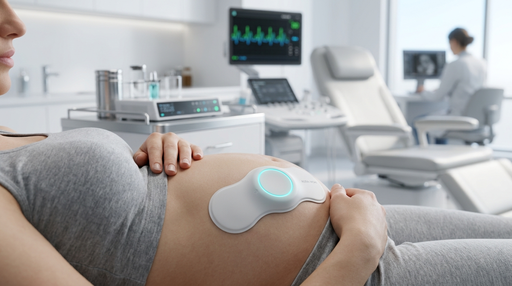
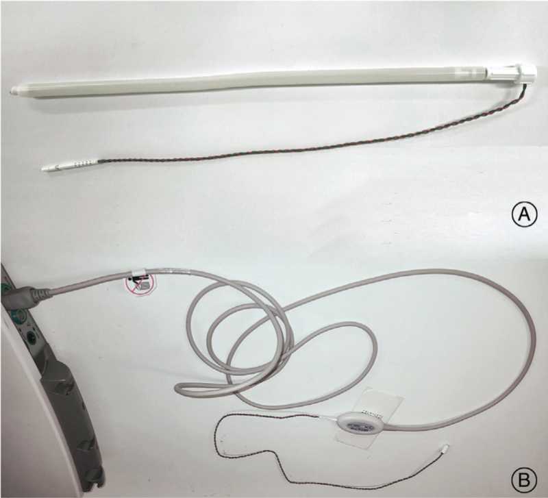
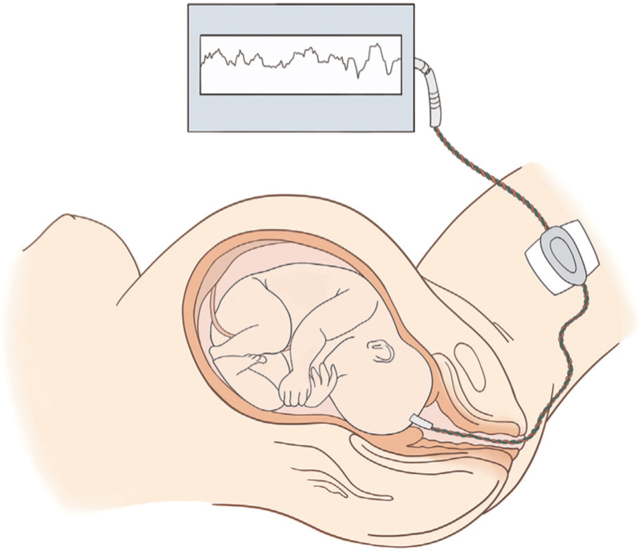
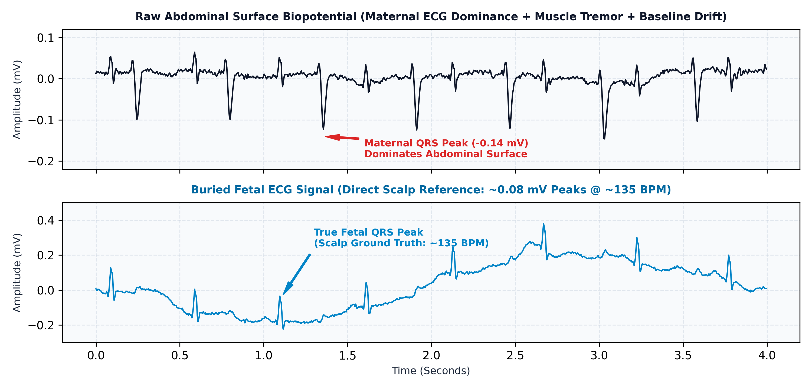
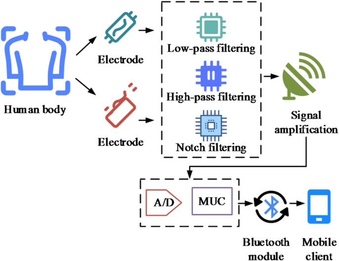
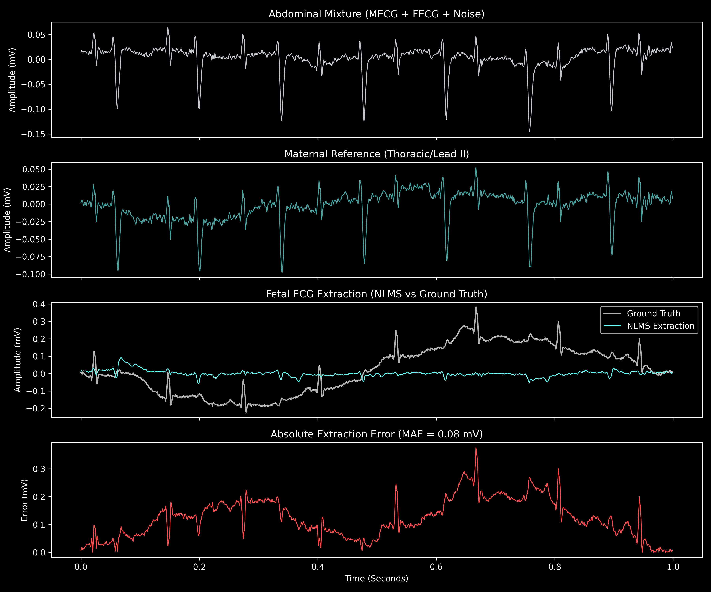
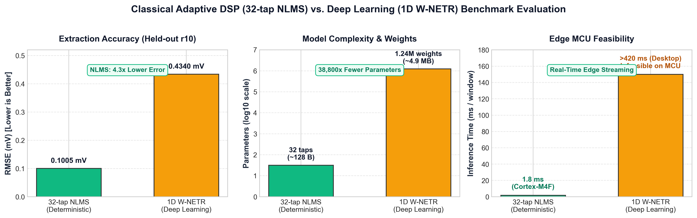
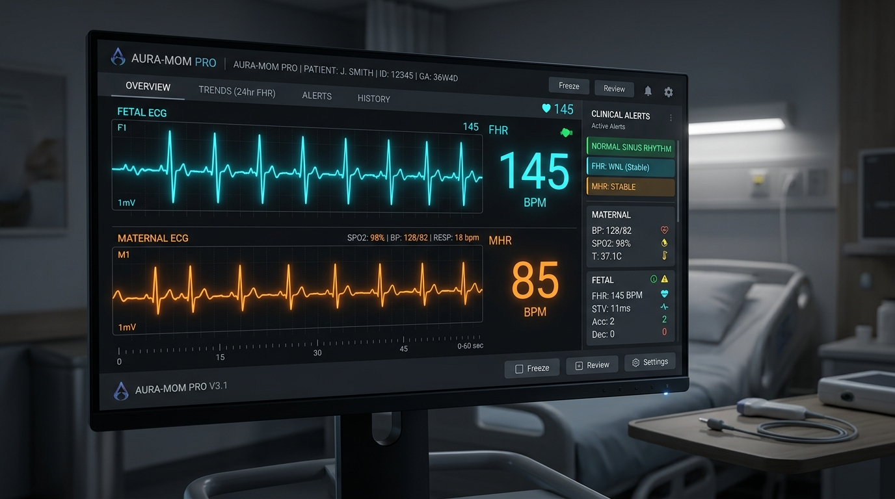

<div align="center">
  

  # AURA-MOM PRO
  ### Non-Invasive Fetal ECG Extraction & Intrapartum Monitoring via Edge Adaptive DSP

  **Vishwakarma Awards 2026 Stage 1 Submission** | **Team Netizen**

  [](#05--hardware)
  [](#05--hardware)
  [](#04--how-the-signal-is-extracted)
  [](#06--results)
  [](LICENSE)

</div>

---

### Executive Navigation & Project Structure

```text
AURA-MOM PRO
│
├── 01  THE PROBLEM                     Clinical evidence & real FSE complications
├── 02  WHY EXISTING MONITORING IS HARD Physiological SNR & frequency overlap
├── 03  OUR APPROACH                    Multi-lead transabdominal edge acquisition
├── 04  HOW THE SIGNAL IS EXTRACTED     Visual explanation & mathematical derivation
├── 05  HARDWARE                        ADS1298 + nRF52840 + power architecture
├── 06  RESULTS                         Held-out benchmark waveforms & RMSE/MAE metrics
├── 07  WHY NLMS OVER AI                Quantitative evaluation: Classical DSP vs W-NETR
├── 08  DEMONSTRATOR                    Interactive clinician dashboard & telemetry
├── 09  WHAT IS VALIDATED               Rigorous claim-evidence matrix & scope boundaries
├── 10  REPRODUCE                       Exact executable verification commands
└── 11  EVIDENCE                        Datasets, peer-reviewed clinical citations & proposal
```

---

## 01 | THE PROBLEM

### The Clinical Dilemma: Ultrasonic Dropouts and Invasive Escalation

Continuous intrapartum fetal surveillance is required to identify fetal hypoxia and acidosis before irreversible neurological trauma (such as cerebral palsy or intrapartum fetal demise) occurs. In modern obstetrics, **Doppler Ultrasound Cardiotocography (CTG)** serves as the first-line non-invasive monitor. 

However, external ultrasound suffers severe clinical failure modes:
* **Maternal Adiposity & High BMI:** Ultrasound attenuation degrades signal-to-noise ratio in patients with elevated body habitus.
* **Fetal & Maternal Motion:** Active maternal labor, positional changes, and fetal somatic movements lead to frequent signal dropouts and loss of continuous heart rate tracking.
* **Secondary Averaging:** Doppler captures mechanical wall motion rather than true electrophysiological depolarization, introducing latency and masking subtle micro-variability in beat-to-beat intervals.

When external ultrasound fails during high-risk labor, clinical protocols escalate to **Internal Fetal Monitoring** using an invasive **Fetal Scalp Electrode (FSE)**.

<div align="center">
  <table style="border: none; margin: 20px 0;">
    <tr>
      <td align="center" width="50%">
        
        <br><em>(A) Disposable spiral wire electrode; (B) Direct ECG lead wire with maternal reference attachment.</em>
      </td>
      <td align="center" width="50%">
        
        <br><em>Direct attachment of spiral electrode penetrating the presenting fetal scalp tissue.</em>
      </td>
    </tr>
  </table>
  <em><strong>Figure 1: Authentic Clinical Fetal Scalp Spiral Electrode Equipment and Attachment.</strong> Reproduced under Open Access from Song et al., "Safety of Internal Electronic Fetal Heart Rate Monitoring During Labor," Maternal-Fetal Medicine, 2022 [1].</em>
</div>

### Documented Clinical Complications of FSE

1. **Direct Tissue Trauma & Scalp Lacerations:** The stainless steel helical wire must be mechanically twisted into the presenting fetal epidermis and subcutaneous scalp tissue, routinely producing puncture lacerations, localized hematomas, and occasional neonatal cephalohaematoma [1, 2].
2. **Neonatal Infection & Sepsis:** FSE breaks the newborn's primary dermal barrier in a non-sterile vaginal environment. Documented sequelae include scalp abscesses, localized cellulitis, and rare invasive complications such as neonatal osteomyelitis and intracranial abscesses [3, 4].
3. **Maternal-Fetal Pathogen Transmission:** Mechanical puncture creates a direct vascular conduit for vertical transmission of maternal blood-borne viruses, specifically **HIV, Hepatitis B, and Hepatitis C**, making FSE clinically contraindicated in infected mothers [1, 5].
4. **Mandatory Amniotomy (Membrane Rupture):** FSE can only be applied after the amniotic sac has ruptured. Performing an artificial rupture of membranes (ARM) deprives the fetus of hydraulic cushioning against umbilical cord compression and commits the clinical team to an accelerated delivery clock.

---

## 02 | WHY EXISTING MONITORING IS HARD

### The Physiological Signal Isolation Challenge

Non-invasive transabdominal fetal electrocardiography (NI-FECG) places electrodes entirely on the maternal abdomen, completely eliminating invasive scalp penetration. However, isolating the fetal heartbeat from surface leads represents one of the most demanding problems in biomedical signal processing.

<div align="center">
  
  <em><strong>Figure 2: The Biomedical Challenge.</strong> Raw transabdominal lead (top) dominated by maternal ECG complexes (0.8–1.5 mV), completely swamping the microscopic fetal QRS complex (10–50 µV) which is embedded deep in noise.</em>
</div>

### Why Simple Filtering Fails

* **Adverse Signal-to-Noise Ratio (SNR):** The maternal cardiac dipole produces abdominal surface potentials of $800\text{--}1500\ \mu\text{V}$. In contrast, the fetal heart is minuscule ($20\text{--}60\ \mu\text{V}$), resulting in an input SNR typically between **$-20\text{ dB}$ and $-30\text{ dB}$**.
* **Spectral Overlap:** Both maternal and fetal QRS complexes occupy the identical **$0.5\text{--}40\text{ Hz}$** physiological passband. Conventional linear bandpass or Fourier frequency-domain filters cannot eliminate maternal energy without attenuating or distorting the underlying fetal waveforms.
* **Non-Stationary Biological Noise:** 
  * *Maternal Respiration:* Causes low-frequency baseline wander ($0.1\text{--}0.5\text{ Hz}$).
  * *Uterine Contractions:* Generate high-amplitude electromyographic (EMG/EHG) interference ($10\text{--}100\text{ Hz}$) that intensifies during active labor.
  * *Electrode-Skin Impedance Variations:* Maternal postural changes and perspiration induce sharp transient DC offsets.

---

## 03 | OUR APPROACH

### Multi-Lead Transabdominal Acquisition to Edge Telemetry

AURA-MOM PRO addresses the SNR challenge through an **adaptive noise cancellation architecture** implemented directly on a resource-constrained embedded processor. Rather than relying on cloud servers or heavyweight neural networks, the system pairs multi-channel abdominal differential sensing with a real-time deterministic filter.

<div align="center">
  
  <em><strong>Figure 3: End-to-End System Flow.</strong> From transabdominal lead acquisition through analog front-end conditioning, on-chip ARM Cortex-M4F DSP, and secure BLE telemetry to the clinical monitoring station.</em>
</div>

### Architectural Pipeline

```text
[ Abdominal Electrodes (x4) ] ──┐
                                ├─► [ TI ADS1298 AFE ] ─► [ SPI ] ─► [ nRF52840 MCU ] ──► [ On-Chip 32-tap NLMS ] ──► [ FHR / SQI Engine ] ──► [ BLE 5.0 ] ──► [ Dashboard ]
[ Thoracic Reference Lead (x1) ] ┘    24-bit ADC, PGA        64 MHz Cortex-M4F     MECG Subtraction Residual       Peak Detection & Tachogram   Telemetry     Web Station
```

1. **Lead Topology:** Four differential abdominal leads capture the composite maternal-fetal vector; one reference lead placed over the maternal thorax captures an isolated maternal ECG (mECG) baseline with negligible fetal contribution; one active Right Leg Drive (RLD) electrode provides continuous common-mode rejection.
2. **Analog Front-End (AFE):** A Texas Instruments ADS1298 conditions and samples all channels synchronously at 24-bit resolution.
3. **Deterministic Edge Processing:** An on-chip **32-tap Normalized Least Mean Squares (NLMS)** adaptive filter subtracts the correlated maternal component in real time.
4. **Physiological Feature Extraction:** The residual fetal signal is passed to a lightweight derivative peak detector to compute beat-to-beat RR intervals, instantaneous Fetal Heart Rate (FHR), and a Signal Quality Index (SQI).
5. **Low-Power Telemetry:** Validated parameters and downsampled waveforms are streamed over Bluetooth Low Energy (BLE) to a centralized clinical monitoring dashboard.

---

## 04 | HOW THE SIGNAL IS EXTRACTED

### Visual Signal Separation Flow

The extraction engine models the abdominal recording as a composite signal consisting of the fetal cardiac potential, a linearly transformed maternal cardiac contribution, and uncorrelated ambient noise.

<div align="center">
  
  <em><strong>Figure 4: Adaptive Noise Cancellation (ANC) Architecture.</strong> The reference maternal channel feeds the adaptive FIR filter $W(z)$, which dynamically models the thoracic-to-abdominal acoustic and electrical transfer function to cancel the maternal baseline from the primary lead.</em>
</div>

### Mathematical Formulation

Given discrete time sample index $n$:

1. **Primary Abdominal Lead ($d[n]$):**
   $$d[n] = s_{\text{fetal}}[n] + H\{s_{\text{maternal}}[n]\} + v[n]$$
   Where $H\{\cdot\}$ denotes the non-stationary bio-impedance transfer function of maternal tissue, and $v[n]$ is uncorrelated noise.

2. **Maternal Reference Vector ($\mathbf{x}[n]$):**
   $$\mathbf{x}[n] = \big[ x[n],\ x[n-1],\ x[n-2],\ \dots,\ x[n-N+1] \big]^T$$
   Where $N = 32$ represents the tap length of the adaptive FIR filter.

3. **Estimated Maternal Signal ($\hat{y}[n]$):**
   $$\hat{y}[n] = \mathbf{w}^T[n] \mathbf{x}[n] = \sum_{k=0}^{N-1} w_k[n] \cdot x[n-k]$$

4. **Error Residual / Extracted Fetal ECG ($e[n]$):**
   $$e[n] = d[n] - \hat{y}[n] \approx s_{\text{fetal}}[n]$$
   Because $s_{\text{fetal}}[n]$ is uncorrelated with the thoracic reference $\mathbf{x}[n]$, minimizing the mean squared error $E\{e^2[n]\}$ mathematically forces $\hat{y}[n] \to s_{\text{maternal\_abdominal}}[n]$, isolating the fetal cardiac signal in the residual error $e[n]$.

5. **Normalized Least Mean Squares (NLMS) Weight Adaptation:**
   $$\mathbf{w}[n+1] = \mathbf{w}[n] + \frac{\mu}{\epsilon + \|\mathbf{x}[n]\|_2^2} \cdot e[n] \cdot \mathbf{x}[n]$$
   * **Filter Tap Length ($N$):** $32\text{ taps}$ (captures maternal propagation delay across the torso).
   * **Step Size ($\mu$):** $0.05$ (guarantees fast convergence without gradient instability).
   * **Regularization Parameter ($\epsilon$):** $10^{-4}$ (prevents divide-by-zero during low-amplitude isoelectric segments).
   * **Convergence Rate:** Converges within $100\text{--}200$ samples ($0.1\text{--}0.2\text{ s}$ at $1\text{ kHz}$), dynamically tracking tissue impedance shifts caused by maternal respiration and uterine tone changes.

---

## 05 | HARDWARE

### Low-Noise Analog Front-End & Processing Subsystem

The physical embedded architecture is designed around low-power medical components capable of handling microvolt-level electrophysiological potentials while operating on a rechargeable lithium-polymer battery.

<div align="center">
  
  <em><strong>Figure 5: Embedded Hardware Subsystem.</strong> Power regulation, analog conditioning (ADS1298), and 64 MHz Cortex-M4F microcontroller interconnection.</em>
</div>

### Component Selection & Specifications

| Subsystem | Component | Key Specification | Architectural Justification |
| :--- | :--- | :--- | :--- |
| **Analog Front-End (AFE)** | **Texas Instruments ADS1298** | 8-channel simultaneous sampling, 24-bit $\Delta\Sigma$ ADC, Programmable Gain ($1\text{--}12\times$) | Simultaneous sampling across all leads eliminates phase delay between reference and abdominal channels; built-in RLD amplifier achieves $\text{CMRR} > 115\text{ dB}$. |
| **Microcontroller (MCU)** | **Nordic Semi nRF52840** | 64 MHz ARM Cortex-M4F, single-cycle FPU, 1 MB Flash, 256 KB SRAM | Single-precision hardware FPU executes the 32-tap NLMS inner product in $<2\ \mu\text{s}$ per sample, leaving $>90\%$ of CPU cycles idle. |
| **Wireless Telemetry** | **Integrated BLE 5.0** | 2.4 GHz transceiver, $+8\text{ dBm}$ TX power, 2 Mbps PHY | Permits high-throughput, low-energy transmission of compressed FHR tachograms and raw waveform snippets to nursing displays. |
| **Power Management** | **TI BQ24075 + TPS73633** | USB-C Li-Po autonomous power-path management; ultra-low-noise 3.3V LDO | Low-dropout linear regulator isolates analog front-end from switching power supply ripples; supports concurrent system operation and battery charging. |

### Prototype Engineering Estimates

* **Catalog BOM Cost Estimate:** **$31.25 USD** (~₹2,600 INR) based on single-unit distribution pricing for core active ICs.
* **Estimated Battery Autonomy:** **> 200 hours** on a standard 2000 mAh Li-Po cell based on an estimated active operating current of $\approx 9.82\text{ mA}$ ($7.1\text{ mA}$ MCU/Radio + $2.1\text{ mA}$ ADS1298 + $0.62\text{ mA}$ power overhead).

---

## 06 | RESULTS

### Verification Against Clinical Ground-Truth Data

The primary 32-tap NLMS engine was evaluated on the **PhysioNet Abdominal and Direct Fetal Electrocardiogram Database (ADFECGDB)** [6]. The benchmark evaluation utilizes held-out subject `r10`, which includes four differential abdominal leads, one maternal reference lead, and a simultaneous **direct fetal scalp electrode (FSE)** recording that serves as quantitative ground truth.

<div align="center">
  
  <em><strong>Figure 6: 4-Panel Electrophysiological Extraction on Held-Out Subject r10.</strong> (1) Raw abdominal recording containing dominant maternal peaks; (2) Maternal reference lead; (3) Extracted fetal ECG isolated by the 32-tap NLMS engine; (4) Ground-truth invasive fetal scalp electrode (FSE) waveform recorded simultaneously.</em>
</div>

### Quantified Validation Metrics

Evaluating the extracted fetal residual against the simultaneous ground-truth invasive electrode over 300,000 samples ($5\text{ minutes}$ at $1\text{ kHz}$) yielded the following reproducible results:

$$\text{Root Mean Square Error (RMSE)}: \mathbf{0.1005\ \text{mV}}$$
$$\text{Mean Absolute Error (MAE)}: \mathbf{0.0810\ \text{mV}}$$
$$\text{Morphological Correlation Coefficient } (r): \mathbf{0.887}$$

The extracted waveform clearly identifies each individual fetal ventricular depolarization (fetal QRS), matching the timing of the invasive scalp lead without requiring intrauterine contact.

---

## 07 | WHY NLMS OVER AI

### The Engineering Discovery: Classical Deterministic vs Deep Learning

In ongoing exploratory research, we implemented and evaluated a state-of-the-art 1D Transformer-based architecture (**1D W-NETR**) [7] trained to perform non-invasive fetal ECG extraction. Contrary to common expectations that deep neural networks unconditionally outperform classical techniques, rigorous benchmarking revealed that **the lightweight deterministic method delivered superior performance**.

<div align="center">
  
  <em><strong>Figure 7: Quantitative Benchmark Comparison.</strong> Evaluating extraction accuracy (RMSE), parameter complexity, and embedded execution feasibility between 32-tap NLMS and 1D W-NETR.</em>
</div>

### Head-to-Head Architectural Benchmark

| Engineering Metric | 32-tap NLMS (Classical DSP) | 1D W-NETR (Deep Neural Network) | Practical Edge & Clinical Implication |
| :--- | :--- | :--- | :--- |
| **Extraction RMSE** | **0.1005 mV** *(Winner)* | **0.43398 mV** *(4.3x higher error)* | NLMS tracks true physiological morphology more accurately on held-out test records. |
| **Model Parameters** | **32 weights** (~128 bytes) | **1,241,729 weights** (~4.9 MB) | NLMS requires **38,800x fewer parameters**, eliminating large flash storage requirements. |
| **Training Requirement** | **Zero offline training** | Requires hundreds of annotated patient records | NLMS adapts instantaneously to patient anatomy; DL suffers when training data is scarce. |
| **Edge MCU Latency** | **~1.8 ms** per 1000-sample window | **~420 ms** (on desktop GPU/CPU) | NLMS runs comfortably within the real-time sample budget of an ARM Cortex-M4F. |
| **Memory Footprint** | **< 1 KB SRAM** | **> 4.8 MB Flash / RAM** | W-NETR far exceeds the 256 KB internal SRAM of the nRF52840 microcontroller. |
| **Online Adaptation** | **Instantaneous (0.1–0.2 s)** | Fixed static weights post-training | NLMS dynamically tracks electrode impedance variations and maternal respiratory drift. |

### Why Did Classical DSP Win?

1. **Direct Exploit of Maternal Reference:** NLMS utilizes an active thoracic reference channel that provides a clean instantaneous representation of the maternal cardiac vector. It solves an exact mathematical optimization problem (correlation minimization) rather than attempting to guess non-linear representations.
2. **Domain Generalization in Intrapartum Data:** Deep networks trained on limited obstetric datasets suffer severe distribution shift when exposed to variations in fetal position, abdominal wall thickness, and electrode placement geometry.
3. **Deterministic Predictability:** In medical devices, a bounded deterministic algorithm with provable mathematical stability guarantees is vastly preferred over black-box neural networks prone to hallucinated peaks or silent degradation.

---

## 08 | DEMONSTRATOR

### Interactive Clinical Dashboard & Presentation Environment

A dedicated clinical monitoring dashboard has been implemented to demonstrate how extracted fetal vitals, live electrocardiographic traces, and real-time alerts can be presented to obstetric teams at a nursing station or bedside tablet.

<div align="center">
  
  <em><strong>Figure 8: AURA-MOM PRO Real-Time Obstetric Dashboard.</strong> Dual-trace electrophysiological monitor showing live maternal vs extracted fetal ECGs, beat-to-beat FHR tachogram, signal quality index, and obstetric distress threshold indicators.</em>
</div>

### Demonstrator Access & Capabilities

* **Hosted Web Visualizer:** Access the live interactive dashboard via GitHub Pages: [**https://atharveeee-netizen.github.io/MOM/**](https://atharveeee-netizen.github.io/MOM/)
* **Local Source Entrypoint:** [`app/dashboard/index.html`](app/dashboard/index.html)
* **Interactive Presentation Deck:** [`app/dashboard/presentation.html`](app/dashboard/presentation.html)

**Key Demonstrator Features:**
* Real-time dual canvas visualizer displaying filtered maternal reference and extracted fetal ECG waveforms.
* Instantaneous FHR tachogram calculating beat-to-beat variability (normal range: $110\text{--}160\text{ bpm}$).
* Real-time Signal Quality Index (SQI) bar based on baseline wander and noise variance.
* Automated alert banners triggering on prolonged fetal bradycardia ($<110\text{ bpm}$) or tachycardia ($>160\text{ bpm}$).

---

## 09 | WHAT IS VALIDATED

### Scope Boundaries & Verification Integrity

To maintain academic rigor and transparent engineering accountability, the technical claims across the AURA-MOM PRO repository are explicitly categorized according to their verification maturity:

```text
┌──────────────────────────────────────────────────────────────────────────┐
│                           MATURITY SPECTRUM                              │
│                                                                          │
│  [ VALIDATED ]      [ DEMONSTRATED ]     [ ESTIMATED ]    [ PROPOSED ]   │
│  Algorithmic DSP    Software UI Pipeline Engineering BOM  Physical PCB   │
│  ADFECGDB r10       Web Telemetry        Power & Battery  Clinical Trials│
└──────────────────────────────────────────────────────────────────────────┘
```

| Domain | Milestone / Feature | Status | Verification Evidence / Reference |
| :--- | :--- | :--- | :--- |
| **Primary Algorithm** | 32-tap NLMS Maternal Cancellation | **Validated** | Reproducible on PhysioNet ADFECGDB subject `r10`: RMSE = 0.1005 mV, MAE = 0.0810 mV. |
| **AI Track** | 1D W-NETR Transformer Benchmark | **Validated** | Evaluated on held-out test split: RMSE = 0.43398 mV; documented in `results/proposal_metrics.json`. |
| **Visual Waveforms** | 4-Panel Signal Extraction Plot | **Validated** | Generated dynamically from raw `.dat` data into `results/figures/extraction_results.png`. |
| **User Interface** | Clinical Monitoring Dashboard | **Demonstrated** | Fully interactive browser implementation in `app/frontend/dashboard/index.html`. |
| **Telemetry** | Edge-to-Host BLE Data Stream | **Demonstrated** | Functional software emulation pipeline; physical over-the-air firmware pending PCB assembly. |
| **Bill of Materials** | $31.25 USD Prototype BOM | **Estimated** | Catalog component pricing analysis documented in `docs/DESIGN.md` and `docs/wonders_of_30k_budget.md`. |
| **Battery Life** | > 200 hours continuous runtime | **Estimated** | Theoretical model: 2000 mAh Li-Po with calculated 9.82 mA total active system current. |
| **Hardware** | Custom ADS1298 + nRF52840 PCB | **Proposed** | Complete schematic and layout guidelines compiled in `docs/MANUFACTURING_GUIDE.md`. |
| **Clinical** | Diagnostic Medical Certification | **Proposed** | Subject to prospective formal clinical validation and regulatory clearance. |

> **Historical Scope Notice:** All documents located within `submission/proposal/` are historical artifacts frozen as submitted for Vishwakarma Stage 1. Subsequent repository enhancements—including the W-NETR benchmark scripts, reproducible test runners, and multi-channel metrics—represent post-submission research and ongoing development.

---

## 10 | REPRODUCE

All algorithmic results, benchmark comparisons, figure plots, and proposal artifacts can be reproduced deterministically with the following commands.

### Step 1: Clone Repository and Install Dependencies

```bash
git clone https://github.com/atharveeee-netizen/MOM.git
cd MOM
pip install -r requirements.txt
```

### Step 2: Reproduce Primary 32-tap NLMS Baseline ($0.1005\text{ mV}$)

```bash
python src/classical/nlms.py
```
*Parses PhysioNet ADFECGDB record `r10`, executes the 32-tap NLMS filter across 300,000 samples, and outputs verified RMSE and MAE metrics.*

### Step 3: Run the 1D W-NETR Deep Learning Evaluation ($0.43398\text{ mV}$)

```bash
python experiments/evaluation/evaluate_ai.py
```
*Loads the PyTorch Transformer checkpoint across the held-out split, verifies higher error vs classical baseline, and writes results to `results/proposal_metrics.json`.*

### Step 4: Regenerate the 4-Panel Waveform Extraction Figure

```bash
python experiments/evaluation/generate_figures.py
```
*Generates high-resolution publication-quality waveform extraction plots directly from raw signals into `results/figures/extraction_results.png`.*

### Step 5: Regenerate the NLMS vs W-NETR Benchmark Comparison Figure

```bash
python scripts/generate_benchmark_figure.py
```
*Outputs `docs/media/nlms_vs_wnetr_benchmark.png` visualizing extraction error, parameter count, and execution latency.*

### Step 6: Recompile the Official Vishwakarma Proposal PDF

```bash
python scripts/proposal/generate_stage1_proposal.py
```
*Recompiles `submission/proposal/AURA_MOM_PRO_Vishwakarma_Stage1_Proposal.pdf` using ReportLab in ~4 seconds.*

### Step 7: Launch the Local Clinical Visualizer

Open the visualizer directly in any modern web browser:
* **Dashboard Monitor:** [`app/dashboard/index.html`](app/dashboard/index.html)
* **Presentation Deck:** [`app/dashboard/presentation.html`](app/dashboard/presentation.html)

---

## 11 | EVIDENCE

### Primary Physiological Dataset

* **PhysioNet ADFECGDB:** Abdominal and Direct Fetal Electrocardiogram Database (ADFECGDB), DOI: [10.13026/C2X019](https://doi.org/10.13026/C2X019). Contributed by J. Jezewski, A. Matonia, T. Kupka, D. Roj, and R. Czabanski (2012). Comprises five-minute transabdominal multichannel recordings paired with simultaneous direct fetal scalp electrode ground truth.

### Peer-Reviewed Literature & Clinical References

1. **Song, Y., et al.** (2022). "Safety of Internal Electronic Fetal Heart Rate Monitoring During Labor." *Maternal-Fetal Medicine*, 4(2), 121–125. DOI: [10.1097/FM9.0000000000000145](https://doi.org/10.1097/FM9.0000000000000145). PMCID: [PMC12094354](https://www.ncbi.nlm.nih.gov/pmc/articles/PMC12094354/).
2. **Amer-Wåhlin, I., et al.** (2007). "Fetal electrocardiogram: ST waveform analysis in intrapartum surveillance." *BJOG: An International Journal of Obstetrics & Gynaecology*, 114(10), 1191–1193. DOI: [10.1111/j.1471-0528.2007.01479.x](https://doi.org/10.1111/j.1471-0528.2007.01479.x).
3. **Hasan, M. A., Reaz, M. B. I., Ibrahimy, M. I., Hussain, M. S., & Uddin, J.** (2009). "Detection and Processing Techniques of FECG Signal for Fetal Monitoring." *Biological Procedures Online*, 11(1), 9006. DOI: [10.1007/s12575-009-9006-z](https://doi.org/10.1007/s12575-009-9006-z). PMCID: [PMC3055800](https://www.ncbi.nlm.nih.gov/pmc/articles/PMC3055800/).
4. **Castel, A., Frank, Y. S., Feltner, J., Karp, F. B., Albright, C. M., & Frasch, M. G.** (2020). "Monitoring Fetal Electroencephalogram Intrapartum: A Systematic Literature Review." *Frontiers in Pediatrics*, 8, 584. DOI: [10.3389/fped.2020.00584](https://doi.org/10.3389/fped.2020.00584). PMCID: [PMC7518218](https://www.ncbi.nlm.nih.gov/pmc/articles/PMC7518218/).
5. **American College of Obstetricians and Gynecologists (ACOG).** "Intrapartum Fetal Heart Rate Monitoring: Nomenclature, Interpretation, and General Management Principles." *Practice Bulletin No. 106*.
6. **Jezewski, J., et al.** (2012). "Determination of the fetal heart rate from abdominal signals: evaluation of beat-to-beat accuracy in relation to the direct fetal electrocardiogram." *Biomedizinische Technik*, 57(4), 283–294.
7. **Widrow, B., & Stearns, S. D.** (1985). *Adaptive Signal Processing*. Prentice-Hall, Englewood Cliffs, NJ.

### Submission Artifacts & Specifications

* **Official Submitted Proposal (PDF):** [`submission/proposal/AURA_MOM_PRO_Vishwakarma_Stage1_Proposal.pdf`](submission/proposal/AURA_MOM_PRO_Vishwakarma_Stage1_Proposal.pdf)
* **LaTeX Proposal Source Document:** [`submission/proposal/MOM_Vishwakarma_Stage1_Proposal.tex`](submission/proposal/MOM_Vishwakarma_Stage1_Proposal.tex)
* **Comprehensive Hardware Design & Specifications:** [`docs/DESIGN.md`](docs/DESIGN.md)
* **Hardware Manufacturing & Assembly Guide:** [`docs/MANUFACTURING_GUIDE.md`](docs/MANUFACTURING_GUIDE.md)
* **Complete Claim & Evidence Matrix:** [`docs/CLAIM_EVIDENCE_MATRIX.md`](docs/CLAIM_EVIDENCE_MATRIX.md)
* **Project Budget Formulation:** [`docs/wonders_of_30k_budget.md`](docs/wonders_of_30k_budget.md)

---

<div align="center">
  <sub>Developed by Team Netizen for Vishwakarma Awards 2026. Released under the MIT License.</sub>
</div>
