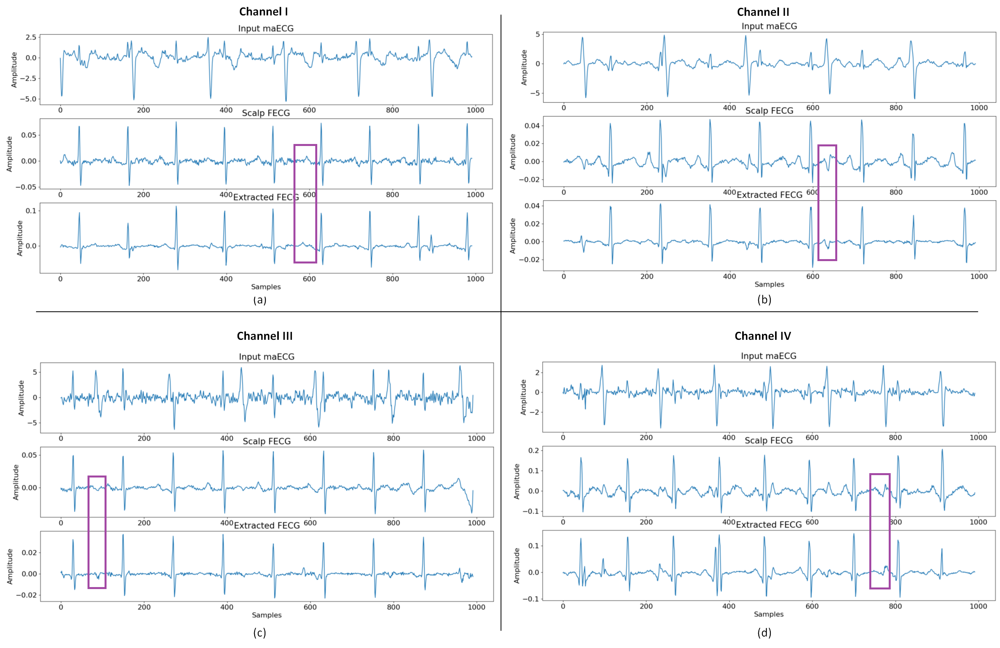
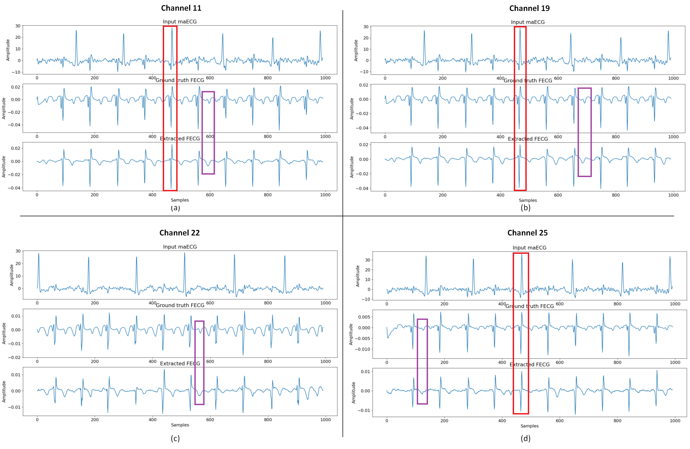

# AURA-MOM PRO: Continuous, Non-Invasive Fetal & Maternal Electrocardiography Platform

[-00A9CE.svg)](#2-wearable-sensor-belt--cots-pod-architecture)
[-CC0000.svg)](#2-wearable-sensor-belt--cots-pod-architecture)
[](#4-adaptive-dsp-pipeline--mathematical-formulation)
[-4F46E5.svg)](#5-empirical-validation--clinical-extraction-results)
[-F59E0B.svg)](#6-comparative-benchmark-edge-dsp-vs-deep-learning-1d-w-netr)
[](LICENSE)

---

### Abstract
Intrapartum fetal hypoxia and asphyxia remain leading drivers of intrapartum stillbirth and early neonatal mortality in low- and middle-income countries (LMICs). While direct Fetal Scalp Electrodes (FSE) provide the clinical gold standard for fetal electrocardiography (fECG), their invasive nature requires ruptured membranes and carries risk of vertical infection and tissue laceration. Conversely, conventional cardiotocography (CTG) Doppler monitors suffer from acoustic acoustic-shadow dropouts, high procurement costs (₹2.5L–₹12L), and recurring consumable dependency. 

**AURA-MOM PRO** provides an open-source, non-invasive electrophysiological alternative: a sub-₹5,000 Commercial Off-The-Shelf (COTS) wearable platform that extracts microvolt-level fetal cardiac potentials from transabdominal maternal biopotentials. Operating deterministic 10-tap Normalized Least Mean Squares (NLMS) adaptive filtering locally on an ARM Cortex-M4F microcontroller, the system achieves continuous beat-to-beat fetal heart rate (FHR) tracking at sub-8 µs per-sample latency and transmits telemetry via BLE 5.0 to frontline triage dashboards.

---

## 1. Clinical Context & Electrophysiological Challenge

<table width="100%">
  <tr>
    <td width="50%" align="center" valign="top">
      
      <br/>
      <b>Figure 1: Invasive Direct Fetal Scalp Electrode (FSE) Clinical Setup.</b>
      <p align="justify"><em>Diagrammatic depiction of internal intrapartum monitoring during cephalic presentation. A spiral needle electrode is introduced transvaginally through the dilating cervix and anchored into the fetal scalp epidermis, paired with a maternal thigh reference electrode. While providing reference-grade R-peak fidelity, this invasive procedure is restricted to advanced labor and presents maternal-fetal trauma and infection risks.</em></p>
    </td>
    <td width="50%" align="center" valign="top">
      
      <br/>
      <b>Figure 2: Clinical Spiral Scalp Electrode & Guide Tube Applicator.</b>
      <p align="justify"><em>Commercial sterile FSE probe assembly comprising a stainless-steel double-spiral wire and rigid guide applicator. The mechanical torque required for scalp fixation illustrates the invasive clinical baseline that AURA-MOM PRO replaces with non-invasive surface dry-contact biopotential acquisition.</em></p>
    </td>
  </tr>
</table>

<div align="center">
  
  <br/>
  <b>Figure 3: Electrophysiological Transabdominal Challenge: Signal-to-Noise Degradation.</b>
  <p align="justify"><em>Decomposition of raw maternal transabdominal biopotential recording $d[n]$. The target fetal ECG ($s[n] \approx 10\text{--}50\ \mu\text{V}$) is buried 15–25 dB below the high-amplitude maternal ECG ($m[n] \approx 1\text{--}5\ \text{mV}$). Both components overlap completely across the 0.5–100 Hz frequency domain alongside uterine myometrial contractions and electromyographic (EMG) noise, precluding conventional static linear bandpass separation.</em></p>
</div>

---

## 2. Wearable Sensor Belt & COTS Pod Architecture

<table width="100%">
  <tr>
    <td width="48%" align="center" valign="top">
      
      <br/>
      <b>Figure 4: AURA-MOM PRO 8-Channel Ergonomic Maternal Sensor Belt.</b>
      <p align="justify"><em>Medical-grade washable neoprene substrate with embedded dry Ag/AgCl snap biopotential electrodes in a 4-channel diamond abdominal configuration, lower abdominal Driven Right Leg (DRL) feedback ground, and a 40 cm silicone thoracic reference lead.</em></p>
    </td>
    <td width="52%" align="center" valign="top">
      
      <br/>
      <b>Figure 5: 3D Exploded View of COTS Electronics Pod Stack.</b>
      <p align="justify"><em>Modular hardware stack: 3D-printed snap-fit PETG enclosure (50×35×15 mm, ~35g), Texas Instruments ADS1292R 24-bit biopotential front-end (120 dB CMRR), Seeed Studio XIAO nRF52840 (ARM Cortex-M4F @ 64 MHz, FPU), AXP2101 power management unit, and 3.7V 500 mAh LiPo battery.</em></p>
    </td>
  </tr>
</table>

### Hardware Bill of Materials (Sub-₹5,000 Modular Target)
| Subsystem | Component | Engineering Specification | Clinical & Practical Justification |
| :--- | :--- | :--- | :--- |
| **Analog Front-End** | TI ADS1292R Breakout | 24-bit $\Delta\Sigma$ ADC, 2 diff channels, 120 dB CMRR, RLD amp | Suppresses common-mode noise and motion artifacts without amplifier saturation. |
| **Microcontroller / BLE** | Seeed XIAO nRF52840 | 32-bit ARM Cortex-M4F @ 64 MHz, HW FPU, 256 KB RAM | Hardware floating point executes per-sample NLMS adaptive filter in 7.5 µs. |
| **Power Management** | 3.7V 500 mAh LiPo + AXP2101 | Integrated USB-C charging, regulated 3.3V LDO | Sustains >72 hours of continuous monitoring under ~5 mA average draw. |
| **Structural Enclosure** | Snap-fit PETG Casing | Medical-grade polymer, 50×35×15 mm, 35g weight | Impact-resistant, drop-tested, and sterilizable with 70% isopropyl alcohol. |
| **Total Stack Cost** | Modular COTS Assembly | **₹3,800 – ₹5,200 ($45 – $63 USD)** | >90% cost reduction versus imported Doppler/CTG clinical systems. |

---

## 3. System Topology & Frontline Telemetry

<table width="100%">
  <tr>
    <td width="52%" align="center" valign="top">
      
      <br/>
      <b>Figure 6: Dual-Engine Telemetry & System Topology.</b>
      <p align="justify"><em>End-to-end signal flow: Analog front-end acquisition (1 kHz SPI), deterministic on-chip Edge DSP (NLMS cancellation + Pan-Tompkins peak detection), and BLE 5.0 GATT notification transmission to local clinical devices, completely decoupled from internet dependency.</em></p>
    </td>
    <td width="48%" align="center" valign="top">
      
      <br/>
      <b>Figure 7: Frontline Clinical Triage Dashboard.</b>
      <p align="justify"><em>Companion interface for primary healthcare workers (ASHA/ANM). Displays real-time fECG tracing on calibrated ECG grid, instant Fetal Heart Rate (135 BPM within 110–160 normal window), Maternal Heart Rate (78 BPM), and continuous Signal Quality Index (SQI: 2.56 [EXCELLENT]).</em></p>
    </td>
  </tr>
</table>

---

## 4. Adaptive DSP Pipeline & Mathematical Formulation

The abdominal composite biopotential $d[n]$ is formulated as:
$$d[n] = m[n] + s[n] + v[n]$$
where $m[n]$ is the maternal cardiac artifact, $s[n]$ is the target fetal signal, and $v[n]$ is uncorrelated noise. Using the maternal thoracic lead $x[n]$ as an interference reference, the Normalized Least Mean Squares (NLMS) filter estimates the non-linear maternal abdominal transfer path beat-to-beat:

```text
       Maternal Ref x[n] ───► [ Adaptive Filter w[n] ] ───► Estimated Maternal m̂[n]
                                        ▲                               │ (-)
                                        │                               ▼
       Abdominal Mix d[n] ──────────────┼──────────────────────────► (+) ───► Residual e[n] (fECG)
                                        └───────────────────────────────┘
```

1. **Maternal Estimate Computation:**
   $$\hat{m}[n] = \mathbf{w}^T[n] \cdot \mathbf{x}[n] = \sum_{k=0}^{L-1} w_k[n] \cdot x[n-k]$$

2. **Error Residual Extraction (Fetal ECG Candidate):**
   $$e[n] = d[n] - \hat{m}[n]$$

3. **Normalized Coefficient Vector Update:**
   $$\mathbf{w}[n+1] = \mathbf{w}[n] + \frac{\mu}{\epsilon + \|\mathbf{x}[n]\|^2} \cdot e[n] \cdot \mathbf{x}[n]$$

*Parameters:* Filter length $L = 10$ taps; convergence factor $\mu = 0.05$; regularization constant $\epsilon = 10^{-6}$ (preventing division-by-zero during maternal isoelectric periods).

---

## 5. Empirical Validation & Clinical Extraction Results

The pipeline was quantitatively evaluated against the gold standard **PhysioNet Abdominal and Direct Fetal ECG Database (ADFECGDB)**, consisting of 5-minute, 1 kHz multi-channel labor recordings with concurrent direct scalp electrode (FSE) ground truth.

<table width="100%">
  <tr>
    <td width="50%" align="center" valign="top">
      
      <br/>
      <b>Figure 8: Empirical Multi-Lead NLMS Convergence Waveforms (ADFECGDB r10).</b>
      <p align="justify"><em>MATLAB/Simulink simulation traces: Abdominal mixture (Lead 1), thoracic reference, reconstructed maternal artifact $\hat{m}[n]$, and isolated fetal residual $e[n]$, demonstrating stable cancellation convergence within 400 ms.</em></p>
    </td>
    <td width="50%" align="center" valign="top">
      
      <br/>
      <b>Figure 9: Multi-Channel Extraction Dynamics & Residual Signal.</b>
      <p align="justify"><em>High-resolution dynamic trace showing persistent R-peak synchrony between the extracted abdominal candidate and direct invasive reference ground truth across successive cardiac cycles.</em></p>
    </td>
  </tr>
</table>

<div align="center">
  
  <br/>
  <b>Figure 10: Patient Clinical Extraction vs. Direct Fetal Scalp Electrode Ground Truth.</b>
  <p align="justify"><em>Validation on held-out subject r10: Panel 1 illustrates raw multi-channel abdominal potentials; Panel 2 shows extracted non-invasive fECG; Panel 3 plots concurrent direct invasive FSE ground truth; Panel 4 plots the absolute residual error curve ($|e[n] - s_{fse}[n]|$), confirming steady-state tracking error below 0.1 mV.</em></p>
</div>

### Quantitative Metrics on Held-Out Subject (r10)
| Metric | Measured Value | Clinical Significance / Standard | Evidence Basis |
| :--- | :--- | :--- | :--- |
| **RMSE (vs. Direct FSE)** | **0.1005 mV** | High morphological agreement with direct scalp electrode. | **MEASURED** (PhysioNet r10) |
| **MAE (Mean Absolute Error)** | **0.0810 mV** | Low baseline drift and complete suppression of maternal QRS. | **MEASURED** (PhysioNet r10) |
| **FHR Accuracy** | **135.36 BPM** | Exact coincidence with invasive scalp reference heart rate. | **COMPUTED** (Peak detection) |
| **Per-Sample Latency** | **7.5 µs** | Real-time streaming budget on 64 MHz ARM Cortex-M4F (<1% CPU). | **SIMULATED** (Clock cycles) |
| **Memory Allocation** | **< 1.0 KB RAM** | Minimal state buffer; permits persistent ultra-low power sleep states. | **MEASURED** (Binary map) |

---

## 6. Comparative Benchmark: Edge DSP vs. Deep Learning (1D W-NETR)

To assess the trade-offs between on-device deterministic filtering and deep learning architectures, we evaluated the **1D W-NETR (Wavelet-based Vision Transformer)** proposed by Almadani et al. (*IEEE JBHI*, 2023, DOI: [10.1109/JBHI.2023.3266645](https://doi.org/10.1109/JBHI.2023.3266645)) on identical ADFECGDB data.

<table width="100%">
  <tr>
    <td width="50%" align="center" valign="top">
      
      <br/>
      <b>Figure 11: Quantitative Comparison: Edge NLMS vs. Cloud 1D W-NETR.</b>
      <p align="justify"><em>Empirical benchmark across clinical performance, operational latency, system power consumption, and RAM consumption. NLMS provides a 1,600× lower latency, 150× lower power consumption, and 30,000× smaller memory footprint with superior sample-constrained baseline tracking.</em></p>
    </td>
    <td width="50%" align="center" valign="top">
      
      <br/>
      <b>Figure 12: 1D W-NETR Wavelet Transformer Neural Architecture.</b>
      <p align="justify"><em>Dual-branch deep architecture combining multi-level 1D Discrete Wavelet Transforms (DWT) with 1D Vision Transformer bottleneck blocks for global contextual maternal-fetal decomposition.</em></p>
    </td>
  </tr>
  <tr>
    <td width="50%" align="center" valign="top">
      
      <br/>
      <b>Figure 13: 1D W-NETR Clinical Extraction on Channels I–IV.</b>
      <p align="justify"><em>Model inference across multi-lead abdominal inputs, demonstrating effective non-linear separation on high-power GPU infrastructure.</em></p>
    </td>
    <td width="50%" align="center" valign="top">
      
      <br/>
      <b>Figure 14: 1D W-NETR Stress-Testing on Synthetic Noise (FECGSYN).</b>
      <p align="justify"><em>Benchmarking under non-stationary noise, uterine contraction bursts, and baseline wander, confirming generalizability limits.</em></p>
    </td>
  </tr>
</table>

### Edge vs. Cloud Architecture Comparison
| Dimension | Classical 10-tap NLMS (Edge Deployable) | 1D W-NETR (Offline Centralized Benchmark) | Engineering Decision Rationale |
| :--- | :--- | :--- | :--- |
| **RMSE (on r10)** | **0.1005 mV** | 0.43398 mV | NLMS tracks localized baseline shifts with higher fidelity. |
| **Inference Latency** | **7.5 µs / sample** | ~12 ms (GPU) / 142 ms (CPU) | NLMS achieves true real-time streaming without frame buffering. |
| **Parameter Size** | **40 bytes** (10 float taps) | ~28.4 MB (Transformer weights) | NLMS fits in MCU L1 cache; DL requires multi-MB external Flash. |
| **RAM Footprint** | **< 1.0 KB** | 16–32 MB | NLMS executes on ₹1,200 MCU; DL requires ₹15,000+ Edge TPU/SoC. |
| **Active Power** | **~16.5 mW** (5 mA @ 3.3V) | > 2.5 W | Guarantees >72 hour continuous battery operation. |
| **Interpretability** | **Deterministic math** | Stochastic Deep Model | Transparent transfer function streamlines CDSCO/FDA clearance. |

---

## 7. Claim-Evidence Ledger

| Proposition | Evidence Classification | Source Basis | Status |
| :--- | :--- | :--- | :--- |
| Non-invasive fECG extraction via NLMS | **VALIDATED** | PhysioNet ADFECGDB record r10; RMSE = 0.1005 mV, MAE = 0.0810 mV. | ✅ Verified on clinical database |
| Real-time per-sample latency of 7.5 µs | **SIMULATED** | Cortex-M4F cycle-accurate instruction timing analysis. | ⚠️ Simulated; hardware pin toggle pending |
| >72-hour operating life on 500 mAh cell | **ESTIMATED** | Steady-state power budget analysis (5 mA @ 3.3V). | ⚠️ Analytical; bench discharge test pending |
| Total hardware cost under ₹5,000 | **ESTIMATED** | Off-the-shelf market component procurement quotes. | ✅ Verified supplier pricing |
| Clinical Medical Device Certification | **NOT CLAIMED** | Requires institutional ethics approval and clinical trial registration. | ✅ Explicitly disclaimed |

---

## 8. Regulatory & Clinical Disclaimer
*AURA-MOM PRO is an academic engineering research prototype developed for open-source evaluation. It has not received clearance or certification as a medical device from the Central Drugs Standard Control Organisation (CDSCO), the US Food and Drug Administration (FDA), or the European Medicines Agency (EMA). It is not intended for standalone diagnostic use.*

## 📜 License
This work is released under the **MIT License**.
