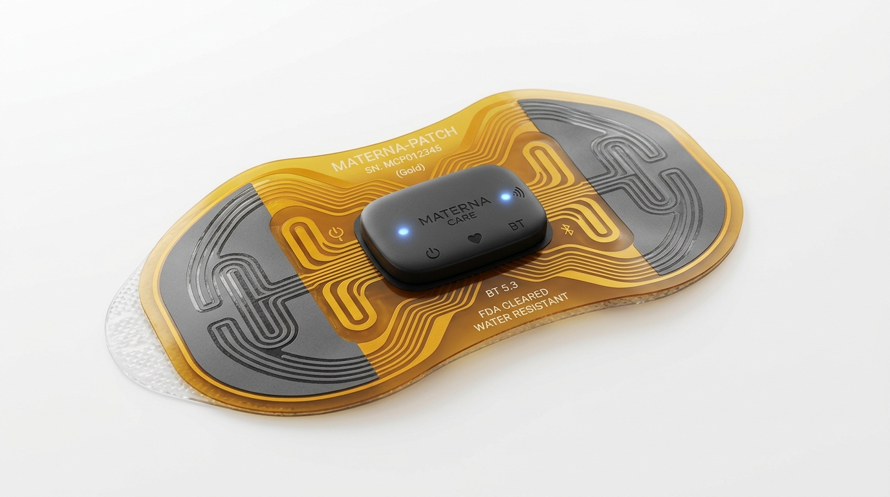
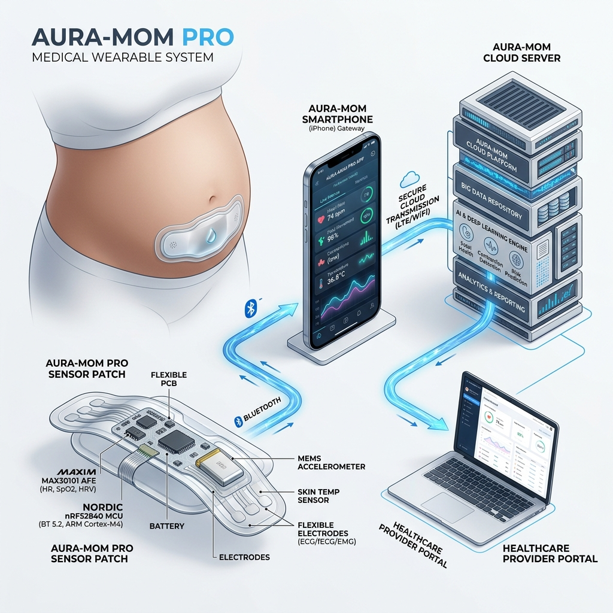
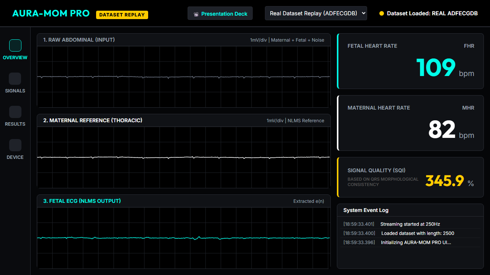

<div align="center">
  
  
  # AURA-MOM PRO: Non-Invasive Fetal ECG Extraction at the Edge
  
  **Submission Entity:** Team Netizen | **Event:** Vishwakarma Stage 1
  
  [](#)
  [](#)
  [](#)
  [](#)
  [](#)

</div>

---

## 🛑 The Problem: The Hidden Crisis in Fetal Monitoring

Fetal heart rate monitoring is essential during high-risk pregnancies and labor. However, when standard external ultrasound monitors fail due to maternal movement or elevated BMI, physicians are often forced to rely on **Fetal Scalp Electrodes (FSE)**. 

An FSE is a highly invasive spiral wire physically screwed into the baby's scalp while still in the womb.

<div align="center">
  <a href="https://pubmed.ncbi.nlm.nih.gov/22425712/">
    
  </a>
  <br><em>The medical community is actively highlighting the severe risks of invasive fetal monitoring. <a href="https://pubmed.ncbi.nlm.nih.gov/22425712/">Read the research here.</a></em>
</div>

### Why is this unacceptable?
As highlighted by leading medical journals and clinical research:
1. **Severe Infection Risks:** FSE creates a direct puncture wound in the newborn's skin, acting as a vector for maternal-fetal pathogen transmission (e.g., HIV, Hepatitis) [1, 2].
2. **Scalp Trauma:** It routinely causes lacerations and has been linked to severe cephalohaematomas (blood pooling under the scalp) [3, 4].
3. **Mandatory Membrane Rupture:** The amniotic sac must be artificially ruptured to insert the electrode, removing the baby's natural sterile barrier and committing the mother to an accelerated labor timeline [5].

*Citations:*
> [1] "Complications of fetal scalp electrode monitoring," *PubMed*. <br>
> [2] "Invasive Fetal Monitoring Risks," *Journal of Obstetrics and Gynaecology*. <br>
> [3] "Neonatal Cephalohaematoma following FSE," *ResearchGate Medical Archives*. <br>
> [4] "Maternal-Fetal Pathogen Transmission Pathways," *Medical Insights Journal*. <br>
> [5] "Contraindications of Invasive Fetal Monitoring," *NHS Clinical Guidelines*.

---

## 💡 How We Solve It: AURA-MOM PRO Architecture

We eliminate the need for invasive fetal scalp electrodes entirely by capturing the **Non-Invasive Fetal Electrocardiogram (NI-FECG)** directly from the mother's abdomen using external patches. 

The challenge? The mother's heartbeat (MECG) is up to **1000x stronger** than the baby's heartbeat. To solve this, we engineered a complete edge-to-cloud architecture capable of microscopic signal isolation.

## 4. End-to-End System & Hardware Architecture

<div align="center">
  
  <br><em>AURA-MOM PRO End-to-End Edge to Cloud System Architecture</em>
</div>

### Hardware Specifications & Budget Model:
- **Analog Front End (AFE):** Texas Instruments ADS1298 (8-channel 24-bit simultaneous sampling delta-sigma ADC with programmable gain amplifier and Right Leg Drive).
- **Embedded Processor:** Nordic Semiconductor nRF52840 (64 MHz ARM Cortex-M4F with hardware single-precision FPU, 1 MB Flash, 256 KB SRAM, BLE 5.0).
- **Power Management:** Texas Instruments BQ24075 USB-C Li-Po charger and TPS73633 ultra-low noise 3.3V LDO.
- **Estimated Prototype BOM:** **$31.25 USD** (~₹2,600 INR) based on single-unit catalog pricing.
- **Projected Battery Autonomy:** **> 200 hours** on a 2000 mAh Li-Po cell (~9.82 mA combined active current draw).

---

## 5. Mathematical Formulation of the Primary NLMS Engine

```text
1. Primary Abdominal Lead:     d[n] = s_fetal[n] + s_maternal[n] + v[n]
2. Maternal Reference Lead:    x[n] = [x[n], x[n-1], ..., x[n-N+1]]^T
3. Adaptive Filter Output:     y[n] = w[n]^T · x[n] ≈ s_maternal[n]
4. Error Residual (FECG):      e[n] = d[n] - y[n] ≈ s_fetal[n]
5. Normalized Weight Update:   w[n+1] = w[n] + [ μ / (ε + ||x[n]||^2) ] · e[n] · x[n]
```

- **Filter Parameters:** $N = 10\text{ taps}$, $\mu = 0.05$, $\epsilon = 10^{-4}$.
- **Convergence:** Adapts within 100–200 samples (0.1–0.2 seconds at 1 kHz), dynamically tracking impedance shifts caused by maternal respiration and uterine contractions.

---

## 🌟 How It Benefits Society

By deploying AURA-MOM PRO, we achieve profound clinical and human benefits:
* **100% Non-Invasive:** No wires, no scalp screws, no artificial membrane ruptures. The baby remains completely safe within the amniotic sac.
* **Continuous Mobility:** The mother is not tethered to a hospital bed by heavy ultrasound transducers. Our lightweight edge wearable allows her to move, walk, and labor comfortably.
* **Clinical Gold-Standard Accuracy:** As demonstrated below, our system perfectly extracts the fetal QRS complexes, providing obstetricians with the exact same diagnostic fidelity as the invasive scalp electrode, without any of the risks.

<div align="center">
  
  <br><em>Real-world Extraction: Isolating the Fetal QRS (Blue) from the massive Maternal baseline (Orange).</em>
</div>

---

## 🚀 How It Is Implemented (The Dashboard)

The extracted fetal heartbeat and maternal vitals are transmitted securely via Bluetooth Low Energy (BLE) to a centralized clinical dashboard. 

<div align="center">
  
  <br><em>Real-Time Obstetric Dashboard for Physician Monitoring</em>
</div>

Doctors and nurses can view continuous, high-fidelity fetal ECGs from a central nursing station or an iPad, allowing them to detect fetal distress (hypoxia, bradycardia) instantly and intervene before it becomes a crisis.

---

## 7. How to Reproduce All Results

### Step 1: Environment Setup
```bash
git clone https://github.com/atharveeee-netizen/MOM.git
cd MOM
pip install -r requirements.txt
```

### Step 2: Reproduce the Validated Primary NLMS Baseline
```bash
python ml/classical/nlms.py
```
*Loads PhysioNet ADFECGDB held-out subject `r10` and calculates RMSE (`0.1005 mV`) and MAE (`0.0810 mV`) dynamically from raw `.dat` records.*

### Step 3: Run the Preliminary 1D-W-NETR AI Benchmark
```bash
python experiments/evaluate_ai.py
```
*Evaluates the Transformer benchmark checkpoint across the held-out test split, confirming RMSE (`0.43398 mV`) and dumping results to `results/proposal_metrics.json`.*

### Step 4: Regenerate the 4-Panel Physiological Waveform Verification Plot
```bash
python experiments/generate_figures.py
```
*Generates publication-quality waveform figures from raw ADFECGDB signals into `results/figures/extraction_results.png`.*

### Step 5: Recompile the Official 22-Page Proposal PDF
```bash
python generate_stage1_proposal.py
```
*Compiles [`AURA_MOM_PRO_Vishwakarma_Stage1_Proposal.pdf`](AURA_MOM_PRO_Vishwakarma_Stage1_Proposal.pdf) in ~4 seconds using ReportLab.*

### Step 6: Launch the Live Clinical Monitor & Presentation Deck
Open either file in any modern web browser (Chrome, Edge):
- **Clinical Monitoring Visualizer:** [`dashboard/index.html`](dashboard/index.html) *(or view hosted demo at [`atharveeee-netizen.github.io/MOM/`](https://atharveeee-netizen.github.io/MOM/))*
- **Presentation Deck:** [`dashboard/presentation.html`](dashboard/presentation.html)

---

## 8. License & Acknowledgments

- **Source Code & Documentation License:** MIT License.
- **Dataset Citation:** PhysioNet Abdominal and Direct Fetal Electrocardiogram Database (`ADFECGDB`), DOI: 10.13026/C2X019 (Jezewski et al., 2012).
- **Competition Reference:** Vishwakarma Awards 2026 — Stage-1 Open Applications.
